# Milestone 1: Data Ingestion System (Apache Kafka)
## Repository: 
[https://github.com/GeorgeDaoud3/SOFE4630U-MS1](https://github.com/GeorgeDaoud3/SOFE4630U-MS1)
## Objectives
1.	Understand the role of the Data Ingestion System in Event Driven Architecture.
2.	Get familiar with Google Pub/Sub and its terminologies.
3.	Be able to create topics, producers, and consumers via GUI.
4.	Create producers and consumers with a Python script.


## What’s Cloud Pub/Sub?
1.	Watch the following video about [Event Driven Architecture (EDA)](https://www.youtube.com/watch?v=o2HJCGcYwoU)
2.	The core component of an EDA is the Data Ingestion System, also known as Publisher/Subscriber (Pub/Sup). Kafka is one of the most frequently used pub/sub. Google Cloud Platform (GCP) has a data ingestion service called Cloud Pub/Sub. Watch the following video to understand [the Cloud Pub/Sub and its terminologies](https://www.youtube.com/watch?v=MjEam95VLiI).

You will start by creating a GCP account. Then, you will learn how to configure topics in a Cloud Pub/Sub and Publish and consume data through the topics.

## Creating GCP account
1. Creating a new Gmail account is recommended, but you can use an existing one if it still allows you a free trial.
2. Go to the [GCP official site](https://cloud.google.com/gcp). Be sure that you are using the correct account. Then, click on **Get Started for Free** button
   
   
4. Fill the account information and accept the terms of services.
   
   
5. In the next step, you will fill in your personal information and a credit card information. That information is to ensure that you are a real person. This will create a free account for 90 days and give you 300+ $ free credits. **No charges are made unless you upgrade to a paid Cloud Billing account**. Please read [the GCP billing verification](https://cloud.google.com/free/docs/free-cloud-features#billing_verification) for more information.
   
   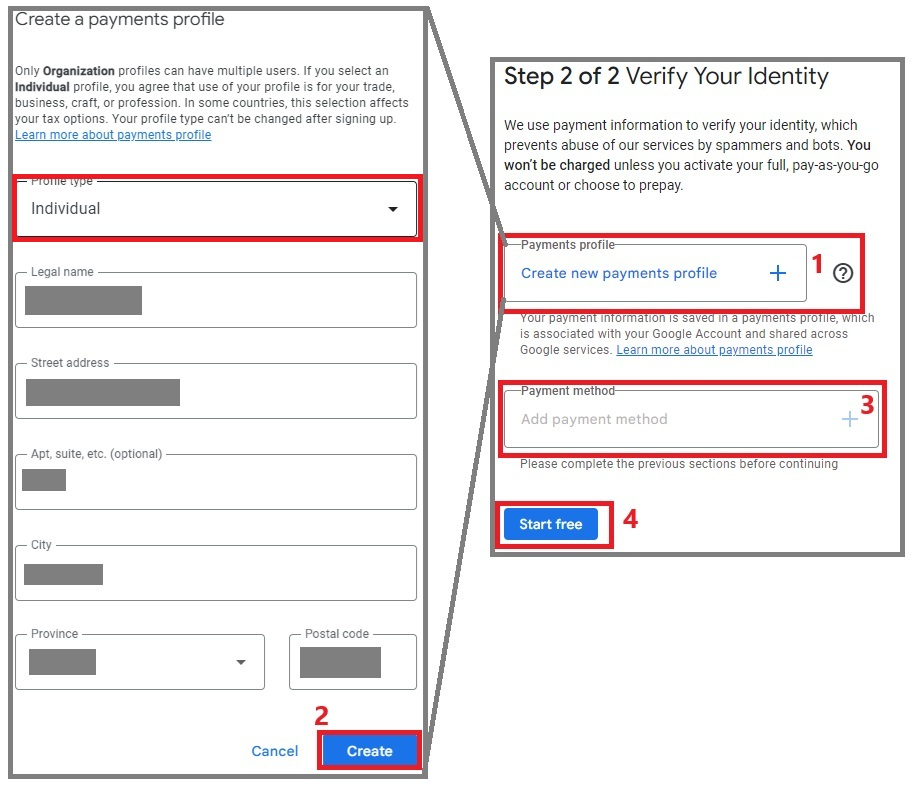
6. Fill in the final survey. Then, click **Done**. You can safely skip any given offers.
   
     
7. Get yourself familiar with
* Dashboard: allows you to search and select available cloud services
* project(s): a project usually named **My First Project** will be created, However, you can create, edit, and delete projects.
* The console: By clicking the console icon, the console will be opened to you. The console is a Linux terminal that can be used to configure the cloud. Any commands affecting the console's local OS will be temporary and lost whenever the session is closed, while any change made to cloud services will be permanent.
  
   
   The console will be opened at the bottom of the page as shown in the following figure and from it we can exchange files and folders with your local computer by downloading or uploading them. You can also click **Open Editor** button to open a text editor.
    
   
* Editor: It’s a text editor that allows you to edit plain text file as shown in the following figure. You can switch back to the console by clicking **Open Terminal** button.
  
   
# Cloud Pub/Sub

In this section, you will learn to create topics in Pub/Sun. Also, you will write and run Python Script to publish into and consume messages from the topic.

## 1. Create a Topic
1.	Search for **Pub/Sub**.  

      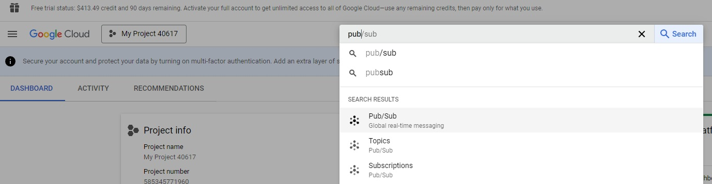  
2.	Click **CREATE TOPIC** button.

      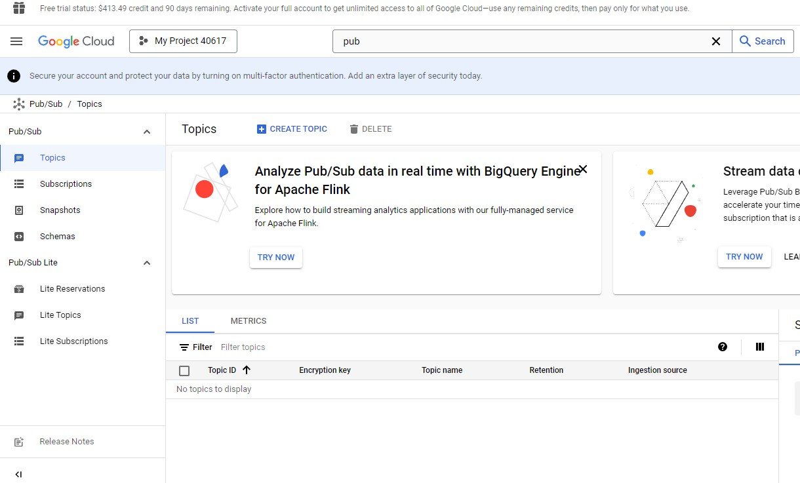  
3.	Set the topic ID to **testTopic**. Leave the default options. Then, click **CREATE**. Note, A default subscription will be automatically created.

      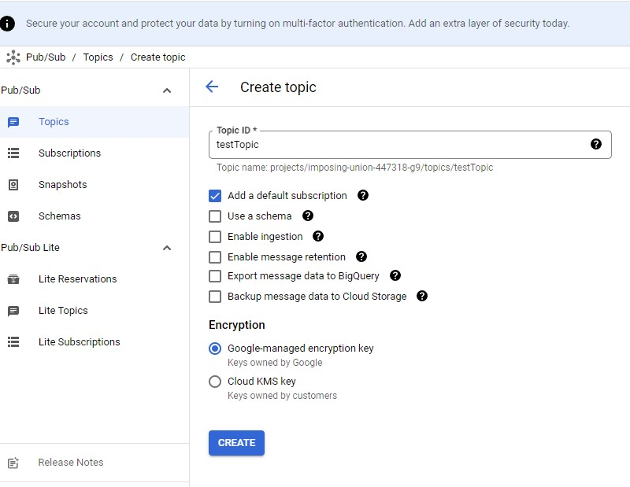  
4.	The topic will be created. The default subscription is created under the name, **testTopic-sub**. 
   
      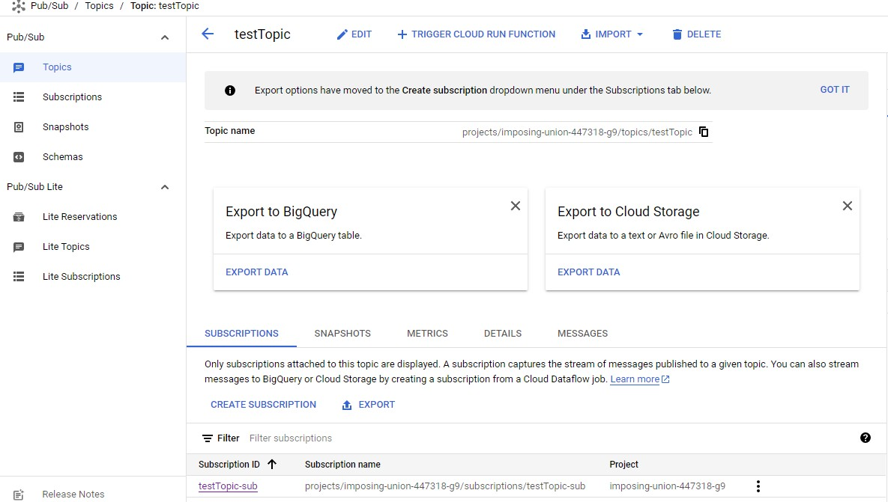  
## 2. Create an Account Service Key

A service account is a special kind of account typically used by an application or compute workload. In this subsection, a service account will be created with the Pub/Sub Publisher and Subscriber roles. A key for this service account is needed To grant access the Pub/Sub service from your machine.

1.	Search for **Service accounts**.
   
      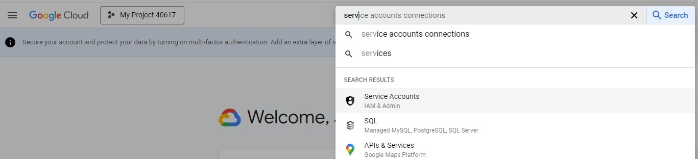  
2.	Click **CREATE SERVICE ACCOUNT** button.

      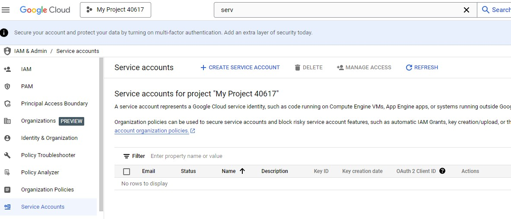  
3. Set the service account name to **pubsub-system**. Then, click **CREATE AND CONTINUE** button.
   
      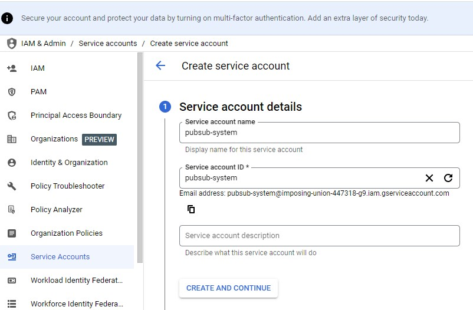  
4. Add two roles to the service account, **Pub/Sub Publisher** and **Pub/Sub Subscriber**

      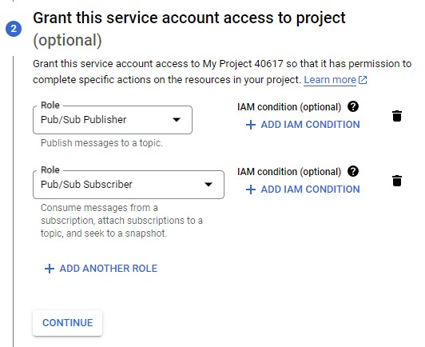    
5.	Don't grant users access. Just, Click Done

      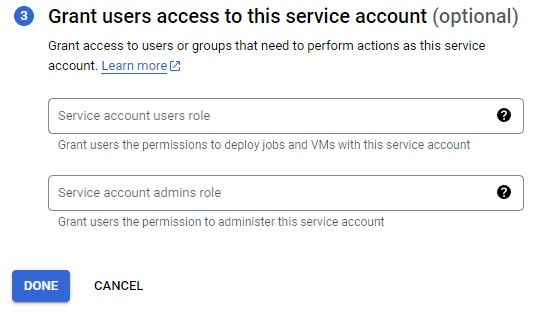  
6.	The service account will be created. To create and a download a key to use the serice account, Click on it.

      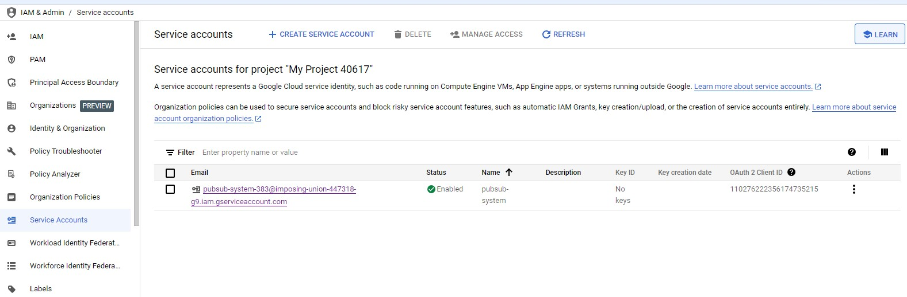  
7. Goto the **keys** tab, Choose **ADD KEY**, and Select **Create new key**.

        
8. Choose **JSON** as the key type. Finally click **CREATE** button to create and download the key to your machine.
  
## 3. Create a Producer (Publisher) Using a Python Script

In this section, a publisher will be created using a Python script to publish messages through the pre-created topic. This code should run on your local machine but you can run it on the cloud console which is not preferable. 

1.	Download the files from folder, **v1**, from the GitHub repository to a certain folder in your computer.  
2.	Copy JSON file containing the key of the serive account obtained in the previous section to the same folder.   
3.	The script containing the producer script is **producer.py** as shown in the following figure. It produces messages to the **testTopic** topic.
   
      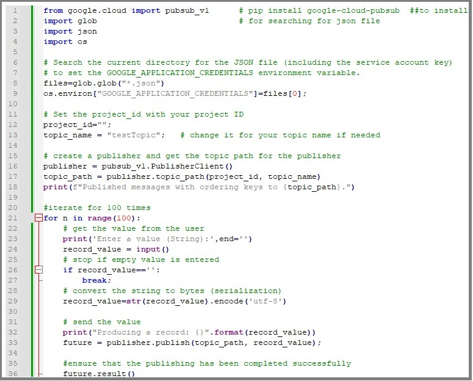  
  
4. Let's go throught the code:
      Lines 1-4 : importing the needed libraries
      Lines 8-9 : search the current directory for JSON files and set the first file found to the environment variable **GOOGLE_APPLICATION_CREDENTIALS**. This enviroment variable will be accessed by the **google.cloud** library to grant access to the Pub/Sub.
      Lines 12-13: define the project name and the topic name. Note you have to set the project name in line 12 before running the script.
      Lines 16-18: create a publisher to the topic and set the full topic path.
      lines 21-36: a loop that will iterate 100 times to publish messages to the topic
      Lines 23-27: get a message from the user and stop the loop for a blank input.
      line 29    : convert the message to bytes. This is called serialization and it's needed before sending the message into the topic.
      Lines 32-33: send the serialized message into the topic.
      Line 36    : ensure that the publishing has been completed successfully. It will throw an exception if a time-out occurs before an acknowledgment has been received.

5. Get the project ID from the GCP console as shown  in the following figure and type it in the 12th line. you can change the topic name in line 13 if needed to match the open you already created in the before.
   
        
   
6. Install the **google.cloud** library by running the following command in the **Command Prompt** window.
   ```shell
   pip install google-cloud-pubsub
   ```
7.	Run the **producer.py** script. Enter some strings to be published.
8.	Check that the messages have been sentto the topic by navigate to the **testTopic-sub** subscription. Select the **MESSAGES** tab and press **pull** button. 
   
        

## 4. Create a Consumer (Subscriber) Using a Python Script

11.	The final script is **consumer.py**. As usual, change the topic name in line 6 to “testTopic2”. The group id is given in the 11th line. Consumers of the same group id will cooperate to read messages from the topic. The group id can be any string. The third rectangle marked in the following figure creates a consumer and subscribes it to the topic. Note, the consumer can subscribe to a set of topics. The poll function at the 23rd line reads messages from the topic. The fifth rectangle marks the code that prints the status and output of the consume function. The last box will end the consumer once **Ctrl-C** is pressed by the user that will trigger the **KeyboardInterrupt**.  

  

## Simulating a Real Meter.

  

1.	Copy the files from **v2** folder from the GitHub repository.
2.	Edit **cred.json** as you did in the previous section.
3.	Edit **createTopic.py** to create a topic called **smartMeter** as you did in the previous section.
4.	Edit **consumer.py** to create a consumer that reads from **smartMeter** topic as you did in the previous section. Leave the file running such that you can consume the messages once they produced to the topic. The only difference in the message get decoded by the **json.loads()** function as the producer will send a JSON object instead of string.
5.	Edit **smartMeter.py** to create to produce smart meter measurements generated randomly. Update the topic name as before to **smartMeter**. The code looks like the same except the lines shown in the following figure. Lines from 12 to 18 have values that will be used to generate messages. Lines 33 till 54 are within a loop that will randomly generate messages that will be sent to the Kafka topic.  
  

## Discussion
* What is EDA? What are its advantages and disadvantages?
* In Kafka, what’s meant by cluster, broker, topic, replica, partition, zookeeper, controller, leader, consumer, producer, and consumer group?

## Design
Google has an alternative ingestion tool called **Google Pub/sub**. Configure it and create a topic using Cloud interface. write a python code for a Google Pub/sub consumer and producer. The producer and the consumer should act as the smart meter shown before. **Note:** they needed a different library than that used for confluent kafka.

## Deliverables
1. A report that includes the discussion and the design parts. 
2. An audible video of about 3 minutes showing the smart meter using confluent cloud Kafka. 
3.  Another  audible  video  of about 5  minutes showing  the  design part. 

